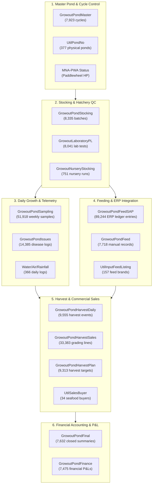
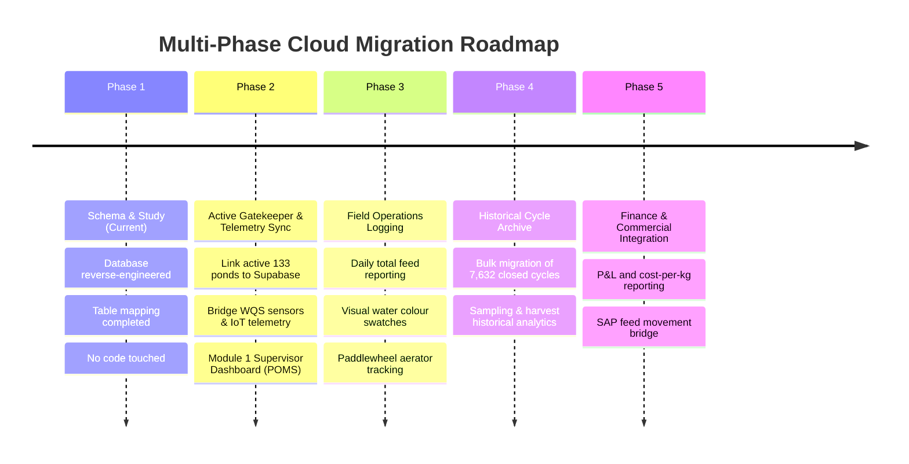

# Legacy Farm Database Study & Architecture Analysis
## Microsoft Access Database (`Bab SGo (r41) 26.09.18.accdb`)

**Project:** Aquaculture Precision Pond Operations & Telemetry Platform  
**Document Purpose:** In-depth architectural reverse-engineering of the legacy Microsoft Access Farm Management System to align with the long-term cloud migration (Supabase) and Web Dashboard.  
**Target File Studied:** `Pond Operations Management System/Legacy Access DB/Bab SGo (r41) 26.09.18.accdb` (180.8 MB)  
**Database Identity:** Blue Archipelago Berhad (BAB) — Setiu Farm (`SETiU`), Terengganu  
**Date:** September 2026  
**Status:** Comprehensive Analysis Complete — Locked for Planning (No Code Modified)  

---

## 1. Executive Summary & Database Vital Statistics

The legacy database is a mission-critical, production-tested enterprise database supporting one of Malaysia's largest commercial shrimp farms (Blue Archipelago Setiu, Terengganu). It encapsulates over **12+ years** of operational culture data, biometrics, feed accounting, SAP ERP movements, disease pathology, laboratory tests, and complete pond cycle P&L accounting.

### Key Database Metrics:
| Metric | Access Value | Alignment with Supabase Target |
| :--- | :--- | :--- |
| **Total Size** | **180.78 MB** | Manageable for PostgreSQL cloud migration |
| **Total Tables** | **118 Tables** | Categorized into 6 core functional domains |
| **Total Views / Saved Queries** | **314 Queries** | Contains embedded farm business logic and calculations |
| **Historical Closed Cycles** | **7,632 Cycles** | Archival data (`GrowoutPondFinal`, `GrowoutPondFinance`) |
| **Current Active Production Ponds** | **133 Ponds** | **Exact 100% match** with our live Supabase `active_operational_ponds` table |
| **Active Physical Ponds Monitored** | **234 Ponds** | 133 Production + 75 Idle + 8 Maintenance + 18 Reservoir |
| **Cataloged Ponds in Master** | **377 Ponds** | Growout, Nursery, Treatment, Reservoirs across Modules |

> [!IMPORTANT]
> **Key Architectural Confirmation:**
> The primary key convention `PondIndex` (e.g., `2010112.43`) discovered in this Access database is **100% identical** to the `pond_index` schema already deployed in Supabase and documented in `SUPABASE_MIGRATION_GUIDE.md`. Our systems are already aligned in their core data language!

---

## 2. Deciphering the `PondIndex` System

The entire database hinges on the compound identifier `PondIndex`:

$$\mathbf{PondIndex} = \text{\textbf{PondCode}} \,.\, \text{\textbf{CycleNo}} \quad \longrightarrow \quad \mathbf{2010112.43}$$

```
   2      01     01     12   .   43
  ───    ────   ────   ────     ────
 Farm    Modl   Row    Pond     Cycle
 Setiu    01     01     12      Cycle 43
```

- **Physical Pond derivation** (from Syafiq's query `SFQ Daily Operational Status`):
  `Mid([PondIndex], 2, 2) & "." & Mid([PondIndex], 4, 2) & "." & Mid([PondIndex], 6, 2)` $\longrightarrow$ **`01.01.12`** (Module 01, Row 01, Pond 12).
- **Physical Pond vs Culture Cycle**:
  - A physical pond (e.g., `01.02.12`) lasts permanently on the farm.
  - A culture cycle is transient (`.43`, `.44`, etc.).
  - Foreign keys in all operational tables link to `PondIndex`, preserving historical cycles forever even after harvest.

---

## 3. High-Level Domain Architecture & Table Classification

The 118 tables divide naturally into **6 Core Functional Domains**:



---

## 4. Deep-Dive Table Breakdown & Key Fields

### Domain 1: Master Pond & Cycle Control
| Table Name | Row Count | Primary Key / Index | Description & Key Fields |
| :--- | :--- | :--- | :--- |
| **`GrowoutPondMaster`** | 7,923 | `PondIndex` | **The Core Spine of the Farm.** Defines cycle state (`pond status` = PRODUCTION/IDLE/MAINTENANCE/CLOSE, `pond active` = ACTIVE/IN ACTIVE), targets (`plan density`, `plan fry`, `plan biomass`, `plan abw`, `plan fcr`, `plan doc`), dates (`date cycle`, `date cleaning`, `DateRepair`, `date filling`, `date ready`, `date close`). |
| **`UtilPondNo`** | 377 | `pond` | Master registry of physical farm assets (`farm`, `modl`, `row`, `area` in hectares e.g. 0.5 ha, `pond type` = FULL LINING, `pond usage` = GROWOUT/NURSERY/TREATMENT/RESERVOIR). |
| **`MNA-PWA Status`** | 216 | `Pond Index` | Aerator inventory tracking paddlewheel aerators (`1HP` count, `2HP` count) per pond cycle. |

### Domain 2: Stocking & Hatchery Lab QC
| Table Name | Row Count | Primary Key / Index | Description & Key Fields |
| :--- | :--- | :--- | :--- |
| **`GrowoutPondStocking`** | 8,335 | `PondIndex` | Stocking events: `stckdate`, `stckspcs` (`P. VANNAMEi`, `P. MONODON`), `stckpcs` (netto), `stckallow` (allowance fry), `stcktotal` (gross fry), `stcktype` (`SPT`), `BSLine` (Broodstock line: `Syaqua`, `Dragon`), `stcktank`, `stcksize` (PL size), `stckplstts` (`NPL`). |
| **`GrowoutLaboratoryPL`** | 8,041 | `Serial No` / `indexNo` | Detailed lab biosecurity & stress test results before stocking: Formalin stress test, Salinity 0 ppt stress test, Micro Vibrio agar counts (Yellow/Green colonies, TVC, VA, VV, VP), PCR results for EMS plasmid, EMS toxin, WSSV, EHP copies. |
| **`GrowoutNurseryStocking`**| 751 | `NurseryIndex` | Nursery stage rearing prior to growout pond transfer. |

### Domain 3: Growth Sampling & Biometrics
| Table Name | Row Count | Primary Key / Index | Description & Key Fields |
| :--- | :--- | :--- | :--- |
| **`GrowoutPondSampling`** | 51,918 | `PondIndex` + `smpldate` | Weekly growth sampling measurements: `SmplDoc` (Day of Culture), `smplabw` (Average Body Weight in grams), `smplsurv` (Survival Rate %), `smplbms` (Estimated Biomass kg), `SmplDFed` (Daily Feed kg), `SmplTFed` (Cumulative Total Feed kg), previous sample comparison (`Psmpldate`, `Psmplabw`), and target strategy curve comparison (`sttgabw`, `sttgsurv`, `sttgbms`, `sttgTFed`). |
| **`GrowoutPondIssues`** | 14,385 | `PondIndex` + `issuedate`| Farm health & disease pathology log: `issueCat` (DISEASE), `issuestts` (EHP, EMS, WSSV), `issuetest` (MICROSCOPY, PCR), `issueflag` (GREEN, YELLOW, RED), `issueGrade` (G0, G1...), `issueNote` (NEGATIVE, POSITIVE). |

### Domain 4: Feeding Operations & SAP ERP Integration
| Table Name | Row Count | Primary Key / Index | Description & Key Fields |
| :--- | :--- | :--- | :--- |
| **`GrowoutPondFeedSAP`** | 89,244 | `Orderno` / `SapPondidx`| Direct mirror of SAP ERP Goods Issue transactions: `SapPondidx`, `SapPostDate`, `SapFeedidx`, `SapFeedName` (e.g. CP 5001, CP 5002), `SapFeedKgs`, `SapMovement` (`261`/`262` issue & reversal). |
| **`GrowoutPondFeed`** | 7,718 | `PondIndex` + `date` | Farm-level manual daily feeding record ledger (`quantity`, `feed` brand). |

### Domain 5: Harvest & Commercial Sales
| Table Name | Row Count | Primary Key / Index | Description & Key Fields |
| :--- | :--- | :--- | :--- |
| **`GrowoutPondHarvestDaily`**| 9,555 | `PondIndex` + `harvdate`| Daily pond harvest runs: `harvstts` (PARTIAL vs TERMINATION), `harvwgt` (harvested kg), `harvabw` (harvest ABW), `harvRev` (gross RM revenue), `harvmtd` (Manual net / machine). |
| **`GrowoutPondHarvestPlan`** | 9,313 | `PondIndex` + `HarvPlanDate` | Pre-harvest targets: `HarvPlanDate`, `HarvPlanStts`, `HarvPlanWgt` (expected biomass), `HarvPlanABW` (target ABW), `HarvPlanTime`, `HarvPlanDelvTime`, `HarvPlanTeam`. |
| **`GrowoutPondHarvestSales`**| 33,383 | `HvtPondIndx` + `HvtDate`| Commercial sales & packout grading breakdown by buyer (e.g., SBH Marine Industries): weights and prices for Good Grades (1–4), 2nd Grade, Small sizes (1–4), Below size, Rubbish deductions, Raw weight vs Net commercial weight, Gross Sales (`HvtSLS`). |

### Domain 6: Cycle Closure & Financial P&L
| Table Name | Row Count | Primary Key / Index | Description & Key Fields |
| :--- | :--- | :--- | :--- |
| **`GrowoutPondFinal`** | 7,632 | `PondIndex` | Cycle summary upon pond closure: `final date`, `final status` (HARVESTED, CULLED POND), `final doc`, `final abw`, `final kg` (total production), `final adg`, `final awg`, `final fcr`, `final sr %`, `quarantine status`. |
| **`GrowoutPondFinance`** | 7,475 | `Pond No` (`PondIndex`) | Complete financial P&L for every culture cycle: Gross Revenue, Costs breakdown (Fries, Feed, Chemicals/Fertilizers, Supplies, Direct Wages, Indirect Wages, Electricity, Repairs & Maintenance, Consultants, Rental, Depreciation, Harvest Expenses, Security), Gross Profit, EBIT, EBITDA, Cost per kg, Cash Cost per kg. |

---

## 5. Reverse-Engineered Business Logic & Formulas

From studying Syafiq's queries (`SFQ *`) and core report views (`GrowoutWeeklyReportSampling`, `GrowoutCommonStocking`):

### 1. Day of Culture (DOC):
$$\text{DOC} = \text{CurrentDate}() - \text{StockingDate}$$

### 2. Stocking Density:
$$\text{Density (pcs/m}^2\text{)} = \frac{\sum(\text{stock gross fry})}{\text{Pond Area (ha)} \times 10,000}$$

### 3. Average Weekly Gain (AWG):
$$\text{AWG (g/week)} = \frac{\text{Current ABW (g)} - \text{Previous Week ABW (g)}}{7} \times 7 = \text{Current ABW} - \text{Previous ABW}$$
*(In query: `Round(([sample abw] - [Smpl2abw]) / 7, 2)` computes daily growth rate ADG over the 7-day interval).*

### 4. Estimated Pond Biomass (kg):
$$\text{Biomass (kg)} = \frac{\text{Survival Count (pcs)} \times \text{ABW (g)}}{1,000}$$
$$\text{Survival Count (pcs)} = \frac{\text{Biomass (kg)}}{\text{ABW (g)}} \times 1,000$$

### 5. Food Conversion Ratio (FCR):
$$\text{FCR} = \frac{\text{Total Feed Consumed (kg)}}{\text{Total Harvested Biomass (kg)} + \text{Mortality Biomass (kg)}}$$

### 6. Survival Rate (SR %):
$$\text{SR \%} = \frac{\text{Total Surviving / Harvested Pieces}}{\text{Total Stocked Fry}} \times 100$$

### 7. Active Production Gatekeeper Condition:
A pond is officially active and culturing shrimp if and only if:
```sql
GrowoutPondMaster.[pond status] = 'PRODUCTION' 
AND GrowoutPondMaster.[pond active] = 'ACTiVE'
```
*(Currently 133 ponds in Setiu).*

---

## 6. Access Table to Supabase Cloud Mapping

| Legacy Access Table | Proposed Supabase Table | Migration Role | Strategy |
| :--- | :--- | :--- | :--- |
| `UtilPondNo` | `master_ponds` | Dimension (Pond Assets) | Seed once (377 physical ponds) |
| `GrowoutPondMaster` (Active) | `active_operational_ponds` | Operational Gatekeeper | Real-time sync (133 active ponds) |
| `GrowoutPondMaster` (All) | `stocking_records` | Master Cycle Dimension | Permanent record of all cycles (7,923 rows) |
| `GrowoutPondStocking` | `pond_stocking_details` | Dimension / Extension | Full cycle genetic, hatchery & PL details |
| `GrowoutPondSampling` | `biometrics_sampling` | Fact Table | Retain weekly ABW, AWG, SR%, Biomass |
| `GrowoutPondFeed` / `FeedSAP` | `daily_feed_records` | Fact Table | Daily feed kg ledger + future SAP sync |
| `GrowoutPondIssues` | `pond_health_issues` | Fact Table | Biosecurity flags (EHP, EMS, WSSV) |
| `MNA-PWA Status` | `pond_aerator_inventory` | Equipment Dimension | PWA units (1HP, 2HP, Total HP) |
| `GrowoutPondHarvestDaily` | `harvest_events` | Fact Table | Partial & final harvests |
| `GrowoutPondHarvestSales` | `harvest_sales_grading`| Commercial Fact | Commercial buyer grading & revenue |
| `GrowoutPondFinal` | `culture_cycle_summaries`| Archival Dimension | Final post-harvest audit records |
| `GrowoutPondFinance` | `pond_cycle_pnl` | Financial Fact | Per-cycle P&L, EBITDA, Cost/kg |
| `GrowoutLaboratoryPL` | `hatchery_qc_tests` | Lab Fact Table | Pre-stocking stress & PCR lab results |

---

## 7. Phased Cloud Migration Roadmap (Zero-Disruption Plan)



### Phase 1: Database Study & Architecture Alignment (Current Milestone)
- Study all tables, relationships, calculations, and queries (completed).
- Keep existing codebases and plans (`SYSTEM_ARCHITECTURE_PLAN.md`) untouched.

### Phase 2: Live Operational Sync (Active 133 Ponds)
- Keep Microsoft Access running in parallel for office administration while feeding live telemetry into Supabase.
- Utilize the `pond_index` bridge to merge real-time IoT sensors (WQS DO, pH, Temp, Salinity, Weather Station, Sonar Feed Barrel) with the 133 active cycles.

### Phase 3: Web-Based Field Operational Logbook (Module 1 Pilot)
- Empower field supervisors and operators with the web dashboard to record daily total feed, tray remnant %, and aerator inventory via smartphone/desktop.

### Phase 4: Full Historical Archive Ingestion
- Cleanly script the one-time historical import of the 7,632 closed cycles, 51,918 sampling rows, and 9,555 harvest events into Supabase historical partition tables for farm-wide multi-year analytics and AI growth forecasting.

---

## 8. Summary for Team Alignment

1. **Perfect Structural Match:** We now know the legacy system inside and out. It uses the exact same `PondIndex` hierarchy (`Farm.Module.Row.Pond.Cycle`) that we planned.
2. **Safety First:** The existing Access database can continue its normal daily farm operations without any interruption.
3. **Clean Path Forward:** We have a complete data dictionary and blueprint ready whenever we decide to link the IoT platform with this enterprise farm database.
